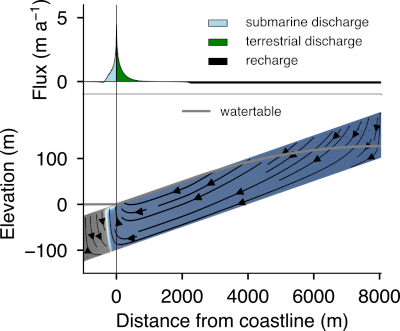

# GroMPy-couple: Coupled density-driven groundwater flow and solute transport model using Python

GroMPy-couple is a 2D cross-sectional model of coupled density-driven groundwater flow and solute transport. The groundwater flow and solute transport euqations are solved by an external finite element model code [esys-escript](https://github.com/LutzGross/esys-escript.github.io). The exchange between groundwater and baseflow/evapotranspiration simulated using a seepage algorithm. GroMPy-couple includes support for automated runs of series of model experiments using parallel computing.

This code was used to run a large set of model experiments that simulate coastal groundwater discharge, as documented in this paper: Luijendijk, E., Gleeson, T. & Moosdorf, N. Fresh groundwater discharge insignificant for the world’s oceans but important for coastal ecosystems. Nat Commun 11, 1260 (2020). [https://doi.org/10.1038/s41467-020-15064-8](https://doi.org/10.1038/s41467-020-15064-8)




## Getting Started

### Required modules
GroMPy-couple requires the following Python modules:

* esys-escript: https://github.com/LutzGross/esys-escript.github.io 
* NumPy:  http://sourceforge.net/projects/numpy/files/NumPy/
* Pandas: https://pandas.pydata.org
* For creating figures (optional):
    * Scipy: http://sourceforge.net/projects/scipy/files/scipy/
    * Matplotlib: http://matplotlib.org/downloads.html


### Installing escript and Grompy 
* Click the download link on the right for a zip file of the source code, or clone the repository
* Install escript
    * get the code here: https://github.com/LutzGross/esys-escript.github.io/releases
    * an installation guide can be found here: https://github.com/LutzGross/esys-escript.github.io/blob/master/install.pdf 
* Unzip the GroMPy-couple source code

The latest succefull installs of GroMPy-couple were on Ubuntu linux version 20.04 and esys-escript version 5.10, using the installation / building from source instructions in the manual.

### Running an example dataset
* Navigate to the directory where you have installed escript and navigate to the `src/bin` directory 
* Execute GroMPy-couple by executing the following command from the command line:
	
```shell
./run-escript <grompy_directory>/grompy.py model_input/model_parameters.py
```

* `<grompy_directory>` is the directory where you have saved GroMPy-couple. GroMPy-couple will now simulate groundwater flow and coastal groundwater discharge using input parameters stored in the file `model_parameters.py` in the model_input directory.
* Alternatively you can also run GroMPy-couple directly from the same directory where GroMPy-couple is located by typing `python grompy.py model_input/model_parameters.py`. However for this to work you first need to add a number of variables to your .bashrc or profile file. Go to the escript/bin directory and type `./run-escript -v` to get a list of the items that you have to add (PATH, LD_LIBRARY_PATH, PYTHONPATH and ESCRIPT_NUM_THREADS), copy-paste them to you barshrc file, and add `EXPORT` before each line. After restarting your terminal and you should now be able to run GroMPy-couple directly without using `run-escript`.


## Model input 
All model parameters are specified in a single python file. Several examples are located in the directory `model_input`, for instance the default parameters file `model_parameters.py`. Each parameter in the example file is briefly described by a comment above each parameter, starting with the symbol #. Unless specified otherwise all parameters are specified in SI units. 

The model parameter file is subdivided in three classes: 
* The first class `ModelOptions` contains a series of options for model runs, which control for example what output files should be generated, where output files should be saved, which processes to model, which solver to use. 
* `ModelParameters` contains all physical parameters that the fluid flow and solute transport model needs. 
* `ParameterRanges` contains values of parameters that you would like to vary in series of model runs to test model sensitivity or explore parameters space. You can use any parameter here that is included in the `ModelParameters` class, by simply copying this parameter anywhere into the `ParameterRanges` class and adding `_s` to the parameter name. The range of parameters to be tested can be specified using a python list or numpy array. For instance to test three values of permeability, which is the parameter `k` add this line to the `ParameterRanges` class: `k_s = [10**-13.0, 10**-12.0, 10**-11.0]`. This will run three models using permeability values of 10<sup>-13</sup>, 10<sup>-12</sup>, 10<sup>-11</sup> m<sup>2</sup>, respectively. If you specify ranges for multiple parameters, the parameter `model_scenario_list = 'sensitivity'` results in a series of model runs with one parameter varied at a time, whereas `model_scenario_list = 'combinations'` will generate model runs that cover all parameter combinations.

## Running multiple models simultaneously
Instead of running single model runs sequentially, you can use ``grompy_parallel.py`` for running multiple models simultaneously. You can use this in the same way as you would start `grompy.py`, by typing the following command: 

~~~sh
$ python grompy_parallel.py model_parameters_sensitivity.py
~~~

This will automatically run all model experiments specified in the model_parameters_sensitivity.py file.

The number of simultaneous model runs is controlled by the parameter `max_proc` in the model parameters file. Note that each single model run will still use the number of cores specified by run-escript (using the -t argument, see the escript documentation), or the OMP_NUM_THREADS setting in your .bashrc or profile file. For example add the following line to your bashrc file if you want GroMPy-couple to use 10 threads for each model run add export OMP_NUM_THREADS=10. If you then set `max_proc = 4` and run grompy_parallel.py, 4 model runs will be executed simultaneously that each use 10 cores. grompy_parallel will start a new run once a run has finished until the entire set of model sensitivity or model parameter combination runs are done.


## Model output

### VTK files
The mesh and variables are saved as VTK files. The VTK files are saved at a location that you can specify by setting the parameter `model_output_dir` in the model parameter file. VTK files can be used by applications such as [Paraview](https://www.paraview.org) or [Mayavi](http://docs.enthought.com/mayavi/mayavi/) to visualize model results.

### Figures
In addition, GroMPy-couple contains a separate python script, ``make_model_fig.py``, to make figures of the model output. To run this file, open a terminal, navigate to the GroMPy-couple directory and run the command `python make_model_fig.py vtk_file`, where `vtk_file` is the path to the VTK file that you would like to make a figure of. If you do not provide a VTK filename and simply run `python make_2d_model_fig.py` the script will look for VTK files in the directory `model_output` and will ask you which subdirectory and which vtk files you want select. Any figures created by this script are saved to new subdirectory `fig` that is placed in the directory that contains the VTK file. The file `model_input/figure_options.py` contains several parameters that control how the figures look,

### Text/CSV files
For each model run input and output data are stored in a .csv file that can be opened with any spreadsheet program or text editor. The filename is `final_model_results_name_date.csv` where name is the model name that you specified in the `scenario_name` parameter in the parameter file and date is a string of the current date. This file contains a copy of each input parameter in the `ModelParameters` class, including the changes made for the parameters that are located in the `ParameterRanges` class for automated multiple model runs. In addition, this file contains a number of other columns with information on the runtime, model convergence, modeled solute concentrations, pressure and fluxes, and some information on the fluxes over the land or sea boundary. Note that the reported boundary fluxes may not be correct for models with an inclined top surface. 

For a more complete analysis of boundary fluxes for each model runs use the script `analyze_boundary_fluxes.py`. Running this script with an argument pointing to a model result csv file like `python analyze_boundary_fluxes.py model_output/final_model_results.csv` will load all VTK files named in this file and report fluxes over the land surface and seabed for each run.


## Example datasets

### Salt water intrusion benchmark
The file `model_input/model_parameters_sw_benchmark.py`, contains example input parameters to reproduce salt water intrusion experiments by Goswami and Clement (2007), Water Resources Research 43 [(link)](http://onlinelibrary.wiley.com/doi/10.1029/2006WR005151/full). 
 
The class `ParameterRanges` contains three values for specified pressure at the left and right hand side of the model domain: ``specified_pressures_s = [[0, 68.569], [0, 19.591], [0, 53.876]]``. This will generate three model runs that follow steady state runs 1, 2 and 3 in Goswami and Clement (2007), with specified pressures at the top right-hand node of  68.569, 19.591 and 53.876 Pa, which mimics the specified freshwater heads of 0.267, 0.2655 and 0.262 cm that are applied in the experiment. The pressure at top node at the left hand side of the model is kept at 0. The specified pressure increases hydrostatically with depth below the top node.

The results of the salt-wedge model runs can be compared to experimental results by Goswami and Clement by running the script `compare_salt_wedge_results.py`. This script will read experimental data from a csv file located in the directory `benchmark_data`, and six VTK files that contain the model results and are also located in the same directory. The script generates a figure that is saved as `benchmark_data/model_vs_experiment.pdf`.


### Coastal groundwater discharge
Three example files for modeling a coastal groundwater system can be found in the `model_input` directory:

* `model_parameters.py`: This file contains parameters for a single model run of the global median coastal watershed, i.e.: a coastal aquifer with median values for permeability, topographic gradient, length and groundwater recharge following the results of a global geospatial analysis.
* `model_parameters_sensitivity.py`: This file contains parameters for a series of model runs to quantify the sensitivity of coastal (submarine and terrestrial) groundwater discharge to controlling parameters such as permeability, recharge, topographic gradient, watershed length and dispersivity. The values of the parameters that will be tested are located in the class `ParameterRanges`, whereas the default parameters are located in the class `ModelParameters`.
* `model_parameters_combinations.py`: Use this input file to run a large (n=450) series of model runs to explore the parameter space for permeability, topographic gradient and groundwater recharge.

## References

Please cite the following paper if you publish work that uses GromPy-couple:

Luijendijk, E., Gleeson, T. & Moosdorf, N. Fresh groundwater discharge insignificant for the world’s oceans but important for coastal ecosystems. Nat Commun 11, 1260 (2020). https://doi.org/10.1038/s41467-020-15064-8 ([link](https://doi.org/10.1038/s41467-020-15064-8))


## Authors
* **Elco Luijendijk**, <elco.luijendijk@uib.no>

## License
This project is licensed under the MIT License - see the [LICENSE.txt](LICENSE.txt) file for details.
